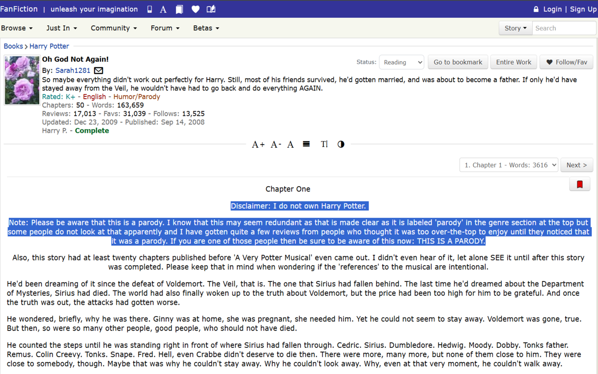
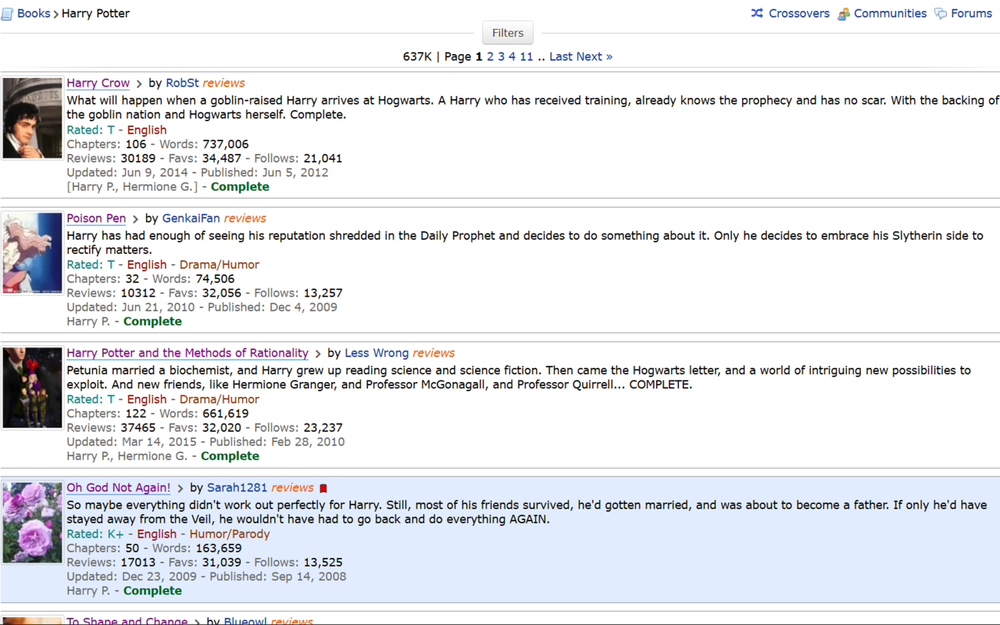
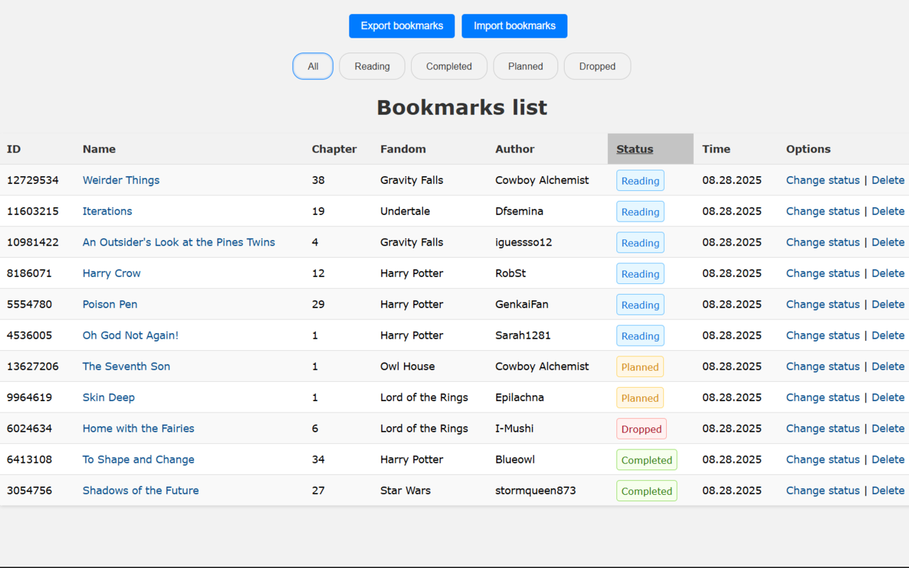
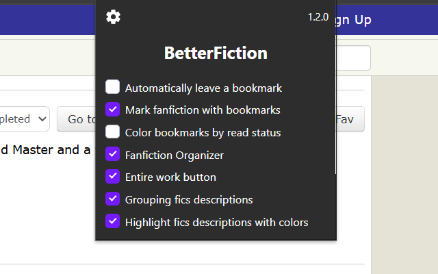
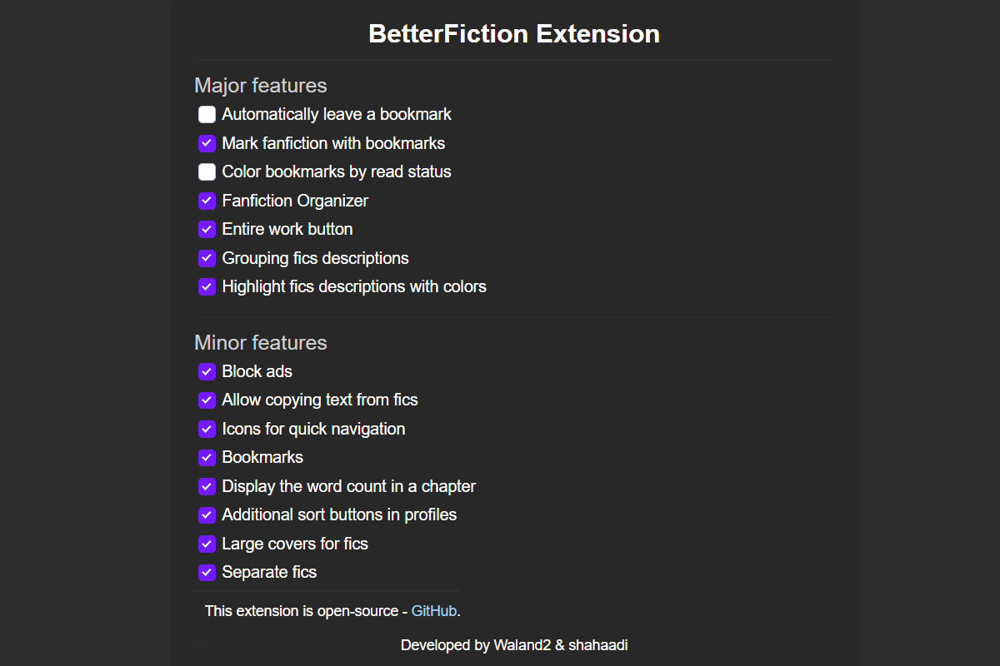

# BetterFiction

A browser extension that improves your FanFiction.net experience with bookmarks, an organizer, entire-work button and more.

## Installation

* **Chrome**: [Chrome Web Store](https://chromewebstore.google.com/detail/betterfiction/phhdklbifojeakgelbijajifknjbhndh)  
* **Firefox**: [Firefox Add-ons](https://addons.mozilla.org/en-US/firefox/addon/betterfiction/)
* **Safari**: [Safari Release](https://github.com/Waland2/BetterFiction/releases/tag/1.1.9)  

## Features

* Keeps bookmarks on stories so you can quickly return to the right place.
* Provides an organizer with statuses (reading, completed, planned, dropped) to track reading progress.
* Adds entire work button.
* Makes story description easier to read by highlighting and grouping details.
* Adds sorting options (favs & follows) on author profiles and quick links to favorites/follows.
* Allow copying text from fics.
* Chpater words counter. 
* Adblock.

## Screenshots

